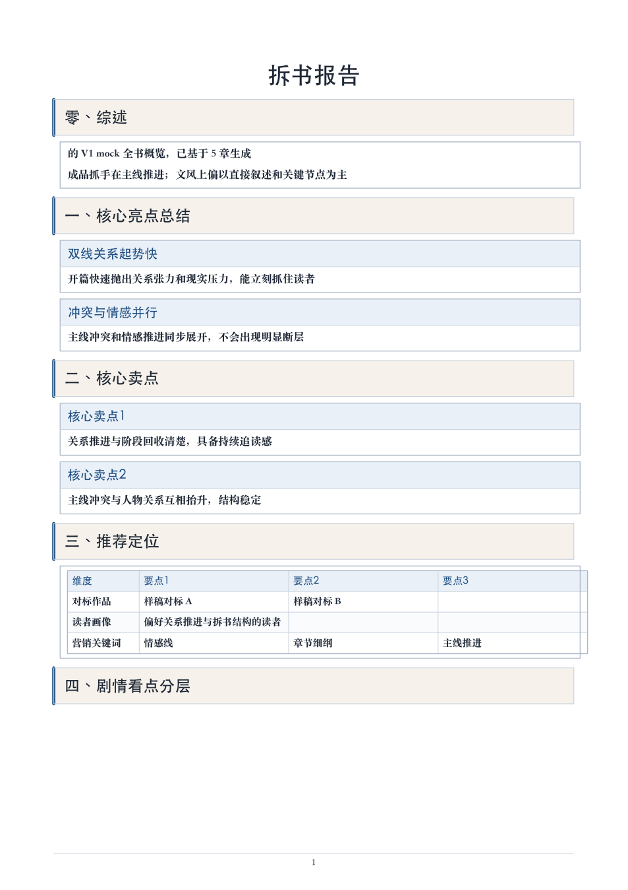
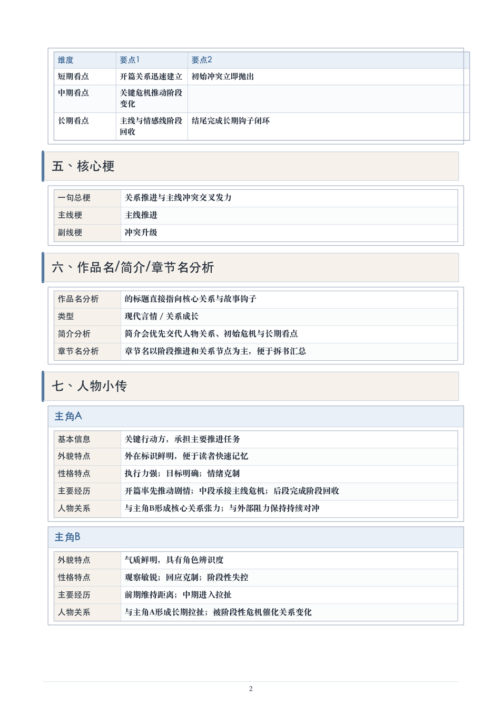

# Novel Analysis Agent

一个长篇小说拆解流水线。输入 `txt / docx / pdf`，输出 Markdown、Docx、PDF 报告，同时留下每一步的中间产物、运行统计和质量检查。

关键词：小说拆解、拆书、novel analysis、long-form text analysis、LLM pipeline、qwen-long、docx export、pdf export。

## 🌱 为什么我觉得它值得单独开源

我做这个工具时，最开始以为难点在提示词。

真的跑起来以后，问题很快变成另一件事：长篇小说太长，报告又不能只给几段概括。读者想看的通常是更细的东西，比如剧情怎么推进、人物关系怎么变化、CP 感靠哪些桥段成立、章节细纲有没有具体情节、文笔到底能拆出什么。

如果只把整本书丢给模型，结果会很飘。前几章可能写得细，后面开始变粗；有些模块会空着；有些句子看起来像还没写完；导出 PDF 时还可能把内部字段暴露出来。

我后来把它拆成一条流水线：

- 先把输入文件规范化。
- 再切章节，切不准时也要留下诊断。
- 每章先做结构化抽取。
- 全书再做聚合。
- 最后统一渲染成报告。
- 导出前再跑质量检查，把空段、残句、内部字段、模块缺失找出来。

这个 repo 放的是脱敏后的可运行版本。真实输入、参考材料和交付内容都没有放进来，示例小说是虚构短文本，默认 `mock` provider 可以直接跑通。

## 🖼️ 最后会长这样

Markdown、Docx、PDF 三种格式会从同一份报告结构生成，避免不同导出格式内容顺序漂移。





完整脱敏样例可以看：

- [examples/sample_report.md](examples/sample_report.md)
- [examples/quality_review.sample.json](examples/quality_review.sample.json)
- [examples/run_summary.sample.json](examples/run_summary.sample.json)

## 🚀 先跑一个本地样例

```bash
python3 -m pip install -e ".[dev]"
analyze-book --input tests/fixtures/sample_novel.txt --provider mock --export markdown,docx,pdf --run-id demo --force
```

跑完以后看：

```text
runs/sample_novel/demo/05_export/book_analysis.md
runs/sample_novel/demo/05_export/book_analysis.docx
runs/sample_novel/demo/05_export/book_analysis.pdf
runs/sample_novel/demo/06_eval/quality_review.json
runs/sample_novel/demo/06_eval/run_summary.json
```

`mock` provider 不会调用外部模型，适合先看流程和产物结构。

## 🔌 接真实模型

我当时的实践里，章节分析和全书聚合用了不同模型。短上下文模型适合做章节级结构化抽取，长上下文模型适合做整书级合并。

复制配置模板：

```bash
cp .env.example .env.local
```

填好自己的 Key 后运行：

```bash
analyze-book \
  --input path/to/your-novel.txt \
  --provider openai \
  --profile mvp \
  --export markdown,docx,pdf \
  --run-id first-full-run
```

如果使用百炼兼容接口，默认推荐：

```text
章节分析：qwen-plus
全书聚合：qwen-long
质量检查：qwen-flash
```

## 📦 目录里有什么

```text
src/novel_agent/
  analysis/        章节分析、全书后处理、报告修复
  exporters/       Markdown / Docx / PDF 导出
  providers/       mock、OpenAI compatible、bailian-long
  cli.py           analyze-book 和 finalize-delivery
  pipeline.py      主流水线
  runtime.py       run 目录、锁、日志
  schemas.py       全部结构化输出模型

tests/
  fixtures/        虚构小说样例
  test_pipeline.py 主链路回归
  test_report.py   报告渲染和清理规则

examples/          已生成的脱敏样例
assets/            README 预览图
```

## 🧭 这条流水线解决了哪些具体问题

我把过程展开写在这几篇文档里：

- [docs/01-story-and-decisions.md](docs/01-story-and-decisions.md)：这个工具怎么从一次交付需求长出来。
- [docs/02-pipeline-walkthrough.md](docs/02-pipeline-walkthrough.md)：每个阶段具体做什么，为什么要留下中间产物。
- [docs/03-report-contract.md](docs/03-report-contract.md)：最终报告要覆盖哪些模块，质量检查会盯哪些问题。
- [docs/04-long-run-notes.md](docs/04-long-run-notes.md)：长任务、断点续跑、重复写入、运行锁这些坑。

## ✅ 验证

```bash
python3 -m pytest -q
```

我保留了几类回归：

- `mock` provider 跑完整链路。
- 同一个 `run_id` 断点续跑。
- 章节失败后记录失败项。
- 导出 Markdown、Docx、PDF。
- 报告里不暴露内部技术字段。
- 质量检查能识别模块缺失、弱占位、导出版式风险。

## 🧪 我最常用的调试入口

长任务跑到一半时，我一般先看这几个文件：

```text
03_chapter_analysis/chapter_status.json
03_chapter_analysis/chapter_analysis.jsonl
03_chapter_analysis/chapter_failures.jsonl
06_eval/run_summary.json
06_eval/stage_stats.json
06_eval/quality_review.json
```

其中 `run_summary.json` 适合快速判断任务是否还在正常推进；`quality_review.json` 适合判断成品能不能发出去。

## 🧰 重新生成最终交付

如果章节分析和全书聚合已经跑完，只想用最新导出规则重建成品：

```bash
analyze-book finalize-delivery \
  --run-dir runs/sample_novel/demo \
  --export markdown,docx,pdf
```

这个命令会重建：

```text
05_export/book_analysis.md
05_export/book_analysis.docx
05_export/book_analysis.pdf
06_eval/quality_review.json
06_eval/reference_alignment_review.json
06_eval/delivery_integrity_review.json
```

## 📄 License

MIT
